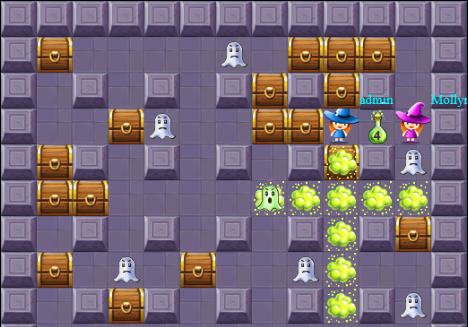

<meta charset="UTF-8">

## Вступление

Игровой demo-сервер доступен так же в интернете 24/7 в целях
ознакомления [http://codenjoy.com/codenjoy-contest](http://codenjoy.com/codenjoy-contest).

Игра с открытым исходным кодом. Для реализации своей игры, исправления
ошибок в текущей и внесения других правок необходимо для начала
[форкнуть проект](https://github.com/codenjoyme/codenjoy.git).
В корне репозитория есть описание в файле Readme.md - там описано, что делать дальше.

По возникающим вопросам, пиши в [skype alexander.baglay](skype:alexander.baglay)
или на почту [apofig@gmail.com](mailto:apofig@gmail.com).

## В чем суть игры?

Будь внимателен: во время игры тебе стоит сосредоточиться на реализации логики
передвижения и активности героя. Остальное - подключение по websocket, некоторое
API для парсинга борды - уже реализовано для тебя.

Надо написать своего бота для героя, который обыграет других
ботов по очкам. Все играют на одном поле. Герой может передвигаться
по свободным ячейкам во все четыре стороны.

Герой может также поставить зелье. Зелье взорвется через 5 тиков
(секунд). Ядовитые газы от зелья могут зацепить обитателей поля.
Все, кто был задет - исчезает. С помощью зелья можно открывать сундуки.
Пострадать можно и на своем, и на чужом зелье. 

На своем пути герой может повстречать призрака - призрачная 
субстанция, уничтожающая на своем пути всех героев. 

Каждый разрушенный объект на поле (герой, призрак, сундуки)
тут же восстанавливается в другом месте. Если пострадал герой,
ему зачисляются штрафные очки -50[*](index.md#ask). 

Герой, от зелья которого были открыты сундуки или уничтожены 
другие участники на карте получит
бонусные очки: за открытый сундук +10[*](index.md#ask), 
за призрака +100[*](index.md#ask), за
другого героя +1000[*](index.md#ask). 

Очки суммируются. Побеждает игрок с большим числом очков (до условленного
времени).

[*](index.md#ask)Точное количество очков за любое действие на
данный момент игры уточни у Сенсея.

## Подключение к серверу

Итак, игрок [регистрируется на сервере](../../../register?gameName=mollymage),
указывая свой email.

Далее необходимо подключиться из кода к серверу через websocket. 
[Эта подборка](https://github.com/codenjoyme/codenjoy-clients.git) 
клиентов для разных языков программирования тебе поможет в твоей игре. 
Как запустить клиент смотри в корне проекта в файле README.md.

Если ты не можешь найти свой язык - придется написать свой клиент
(а после пошарить с нами на почту [apofig@gmail.com](mailto:apofig@gmail.com))

Адрес для подключения к игре на сервере выглядит так (ты можешь скопировать его 
из игровой комнаты):

`https://[server]/codenjoy-contest/board/player/[user]?code=[code]`

Тут `[server]` - домен или ip-адрес игрового сервера, `[user]` - id игрока, a `[code]` -
твой security token. Убедись что код хранится в тайне, иначе любой участник
сможет играть от твоего имени.

## Формат сообщений

После подключения клиент будет регулярно (каждую секунду) получать строку
символов — с закодированным состоянием поля. Формат таков:

`^board=(.*)$`

C помощью этого regexp можно выкусить строку доски.

## Пример поля

Вот пример строки от сервера:

<pre>board=☼☼☼☼☼☼☼☼☼☼☼☼☼☼☼☼☼☼☼☼☼☼☼☼☼☼☼☼☼☼☼☼☼☼ #   # #  #♥#  #  #  &        #☼☼♥☼♥☼♥☼#☼ ☼ ☼ ☼ ☼♥☼ ☼ ☼#☼#☼♥☼#☼#☼☼#♥♥  ♥#   # #♥   # ♥#          ☼☼ ☼ ☼#☼ ☼♥☼ ☼ ☼#☼ ☼ ☼ ☼ ☼&☼ ☼ ☼ ☼☼     ♥          # #            ☼☼ ☼ ☼ ☼ ☼♥☼ ☼ ☼♥☼#☼ ☼ ☼ ☼ ☼ ☼ ☼ ☼☼#       # #       ☺& 2  #  #  #☼☼#☼♥☼ ☼#☼ ☼ ☼ ☼ ☼ ☼ ☼ ☼ ☼#☼ ☼ ☼ ☼☼#  # ♥#               # ♥   #  ☼☼ ☼ ☼#☼#☼ ☼ ☼ ☼ ☼ ☼ ☼ ☼ ☼ ☼ ☼#☼ ☼☼   #♥ #      #                 ☼☼ ☼ ☼ ☼ ☼♥☼ ☼ ☼ ☼ ☼ ☼ ☼ ☼ ☼ ☼ ☼#☼☼     ## #     #   # #   ♥      ☼☼ ☼ ☼♥☼ ☼ ☼#☼ ☼#☼ ☼ ☼♥☼ ☼ ☼ ☼ ☼ ☼☼       #♥       #      ## # ###☼☼ ☼ ☼ ☼#☼ ☼ ☼#☼ ☼ ☼#☼#☼&☼ ☼ ☼ ☼ ☼☼       #       #    ♣# #     ♥ ☼☼ ☼ ☼ ☼♥☼ ☼ ☼ ☼ ☼ ☼ ☼ ☼ ☼ ☼ ☼#☼ ☼☼        ## ## ♥             # #☼☼ ☼ ☼ ☼ ☼ ☼ ☼ ☼ ☼ ☼ ☼ ☼ ☼ ☼ ☼ ☼ ☼☼                   &    ###  ##☼☼ ☼ ☼ ☼ ☼ ☼ ☼#☼ ☼#☼ ☼ ☼ ☼ ☼ ☼ ☼ ☼☼                   ♥ ##        ☼☼ ☼ ☼ ☼ ☼ ☼ ☼ ☼ ☼ ☼ ☼ ☼♥☼#☼ ☼ ☼ ☼☼     ##         &#         #   ☼☼ ☼ ☼ ☼#☼ ☼ ☼ ☼ ☼ ☼ ☼ ☼#☼ ☼ ☼ ☼ ☼☼   #   #         #     # &     ☼☼♥☼ ☼ ☼ ☼ ☼ ☼ ☼ ☼ ☼ ☼ ☼ ☼ ☼#☼#☼ ☼☼  #                    ##   &  ☼☼ ☼ ☼ ☼ ☼ ☼#☼ ☼ ☼ ☼ ☼ ☼ ☼#☼ ☼#☼ ☼☼ #    # &        #       #     ☼☼☼☼☼☼☼☼☼☼☼☼☼☼☼☼☼☼☼☼☼☼☼☼☼☼☼☼☼☼☼☼☼☼</pre>

Длинна строки равна площади поля. Если вставить символ
переноса строки каждые `sqrt(length(string))` символов, то
получится читабельное изображение поля.

<pre>☼☼☼☼☼☼☼☼☼☼☼☼☼☼☼☼☼☼☼☼☼☼☼☼☼☼☼☼☼☼☼☼☼
☼ #   # #  #♥#  #  #  &        #☼
☼♥☼♥☼♥☼#☼ ☼ ☼ ☼ ☼♥☼ ☼ ☼#☼#☼♥☼#☼#☼
☼#♥♥  ♥#   # #♥   # ♥#          ☼
☼ ☼ ☼#☼ ☼♥☼ ☼ ☼#☼ ☼ ☼ ☼ ☼&☼ ☼ ☼ ☼
☼     ♥          # #            ☼
☼ ☼ ☼ ☼ ☼♥☼ ☼ ☼♥☼#☼ ☼ ☼ ☼ ☼ ☼ ☼ ☼
☼#       # #       ☺& 2  #  #  #☼
☼#☼♥☼ ☼#☼ ☼ ☼ ☼ ☼ ☼ ☼ ☼ ☼#☼ ☼ ☼ ☼
☼#  # ♥#               # ♥   #  ☼
☼ ☼ ☼#☼#☼ ☼ ☼ ☼ ☼ ☼ ☼ ☼ ☼ ☼ ☼#☼ ☼
☼   #♥ #      #                 ☼
☼ ☼ ☼ ☼ ☼♥☼ ☼ ☼ ☼ ☼ ☼ ☼ ☼ ☼ ☼ ☼#☼
☼     ## #     #   # #   ♥      ☼
☼ ☼ ☼♥☼ ☼ ☼#☼ ☼#☼ ☼ ☼♥☼ ☼ ☼ ☼ ☼ ☼
☼       #♥       #      ## # ###☼
☼ ☼ ☼ ☼#☼ ☼ ☼#☼ ☼ ☼#☼#☼&☼ ☼ ☼ ☼ ☼
☼       #       #    ♣# #     ♥ ☼
☼ ☼ ☼ ☼♥☼ ☼ ☼ ☼ ☼ ☼ ☼ ☼ ☼ ☼ ☼#☼ ☼
☼        ## ## ♥             # #☼
☼ ☼ ☼ ☼ ☼ ☼ ☼ ☼ ☼ ☼ ☼ ☼ ☼ ☼ ☼ ☼ ☼
☼                   &    ###  ##☼
☼ ☼ ☼ ☼ ☼ ☼ ☼#☼ ☼#☼ ☼ ☼ ☼ ☼ ☼ ☼ ☼
☼                   ♥ ##        ☼
☼ ☼ ☼ ☼ ☼ ☼ ☼ ☼ ☼ ☼ ☼ ☼♥☼#☼ ☼ ☼ ☼
☼     ##         &#         #   ☼
☼ ☼ ☼ ☼#☼ ☼ ☼ ☼ ☼ ☼ ☼ ☼#☼ ☼ ☼ ☼ ☼
☼   #   #         #     # &     ☼
☼♥☼ ☼ ☼ ☼ ☼ ☼ ☼ ☼ ☼ ☼ ☼ ☼ ☼#☼#☼ ☼
☼  #                    ##   &  ☼
☼ ☼ ☼ ☼ ☼ ☼#☼ ☼ ☼ ☼ ☼ ☼ ☼#☼ ☼#☼ ☼
☼ #    # &        #       #     ☼
☼☼☼☼☼☼☼☼☼☼☼☼☼☼☼☼☼☼☼☼☼☼☼☼☼☼☼☼☼☼☼☼☼</pre>

Первый символ строки соответствует ячейке расположенной в левом
верхнем углу и имеет координату `[0, 32]`. В этом примере — позиция
героя (символ `☺`) — `[19, 25]`. Левый нижний угол имеет координату `[0, 0]`.

Как это поле выглядит в реале:

## Расшифровка символов

Расшифровку символов ты можешь [найти тут](elements-ru.md).

## Как играть?

Игра пошаговая, каждую секунду сервер посылает твоему клиенту
состояние обновленного поля на текущий момент и ожидает ответа
команды герою. За следующую секунду игрок должен успеть дать
команду герою. Если не успел — детектив стоит на месте.

Твоя цель заставить героя двигаться в соответствии с задуманным тобой алгоритмом.
Герой на поле должен уметь зарабатывать так много очков, как только сможет.
Основная цель игры - обыграть по очкам всех соперников.

## Команды управления

Команд несколько: 
* `UP`, `DOWN`, `LEFT`, `RIGHT` – приводят к движению героя в
  заданном направлении на 1 клетку.
* `ACT` - оставить зелье на месте героя. Также, если у героя есть перк 
  `POTION_REMOTE_CONTROL` - он может взорвать свое зелье дистанционно 
  по второй команде `ACT` тогда, когда ему это потребуется.
* `АСТ,<DIRECTION>`,`<DIRECTION>,АСТ` - команды движения можно
  комбинировать с командой `ACT`, разделяя их через запятую. Порядок 
  `LEFT,ACT` или `ACT,LEFT` - имеет значение, либо двигаемся 
  влево и там ставим зелье, либо ставим зелье, а затем ходим
  влево. Если игрок будет использовать только одну команду `ACT`, то зелье
  установится под героем без его перемещения на поле. 
* `АСТ(1),<DIRECTION>` - Используется только при наличии перка 
  `POISON_THROWER`. Позволяет бросить в сторону противника 
  пары яда. Используется в паре с командой смены направления 
  движения, разделенные через запятую. Порядок
  `LEFT,ACT(1)` или `ACT(1),LEFT` - значения не имеет. Без указания 
  направления ничего не произойдет, герой останется стоять на месте.
* `ACT(2)` - работает только с перком `POTION_EXPLODER`. После вызова 
  команды все зелья на поле взрываются одновременно. Действует на все 
  зелья (собственные, командные, вражеские, дистанционные).
  Может использоваться как одна команда и может сочетаться с направлением.
  Пример: `RIGHT,ACT(2)` - в этом случае Молли попытается двигаться 
  вправо, после чего все зелья на поле взорвутся.

## Настройки

Параметры будут меняться[*](index.md#ask) по ходу игры. Значения по-умолчанию
представлены в таблице ниже:

## Кейзы

##  Спроси Сенсея
Параметры могут изменяться по ходу игры. Настройки текущей игры
ты сможешь всегда [подглядеть тут](/codenjoy-contest/rest/settings/player).
Пожалуйста, спроси у Сенсея как интерпретировать эти данные. Ты можешь найти Сенсея
в чате, который подготовили организаторы для обсуждения вопросов.

## Подсказки

Первостепенная задача – написать websocket клиента, который подключится
к серверу. Затем заставить цифры на поле слушаться команд.
Таким образом, игрок подготовится к основной игре.
Основная цель – вести осмысленную игру и победить.

Если ты не знаешь с чего начать, попробуй реализовать следующие алгоритмы:

* Перейти в случайную пустую соседнюю ячейку.
* Продвинуться вперед в свободную клетку в направлении ближайшего сундука.
* Попробуй взорвать что-то зельем.
* Попробуй спрятаться от взрывной волны.
* Попробуй избежать привидений и других героев.

## Клиент и API

Сейчас реализованы клиенты для игры для некоторых языков программирования. 
Другие языки в процессе написания (спасибо игрокам-активистам!).

Слишком много форы клиентский код не дает играющим, поскольку в этом коде
еще надо разобраться, но там реализована логика общения с сервером +
некоторое высокоуровневое API для работы с доской (что уже приятно).

Все языки так или иначе имеют похожий набор методов:

* `Solver`
  Пустой класс с одним методом — ты должен(должна) наполнить его умной логикой.
* `Direcion`
  Возможные направления движения для этой игры.
* `Point`
  `x`, `y` координаты.
* `Element`
  Тип элемента на доске.
* `Board` - инкапсулирует логику для удобного поиска и манипуляции элементами на поле.
  Ты можешь найти следующие методы в Board классе:
* `int boardSize();` 
  Размер доски.
* `boolean isAt(Point point, Element element);` 
  Находится ли в позиции point заданный элемент?
* `boolean isAt(Point point, Collection<Element> elements);` 
  Находится ли в позиции point что-нибудь из заданного набора?
* `boolean isNear(Point point, Element element);` 
  Есть ли вокруг клеточки с координатой point заданный элемент?
* `boolean isBarrierAt(Point point);` 
  Есть ли препятствие в клеточке point?
* `int countNear(Point point, Element element);` 
  Сколько элементов заданного типа есть вокруг клетки с point?
* `Element getAt(Point point);` 
  Элемент в текущей клетке.
* `Point getHero();` 
  Позиция моего героя на доске.
* `boolean isGameOver();` 
  Жив ли мой герой?
* `Collection<Point> getOtherHeroes();` 
  Позиции всех остальных героев (из твоей команды) на доске.
* `Collection<Point> getEnemyHeroes();` 
  Позиции героев противника на доске.
* `Collection<Point> getBarriers();` 
  Позиции всех объектов препятствующих движению.
* `Collection<Point> getGhosts();` 
  Позиции всех призраков.
* `Collection<Point> getWalls();` 
  Позиции всех бетонных стен.
* `Collection<Point> getTreasureBoxes();` 
  Позиции всех сундуков с сокровищами (их можно открывать).
* `Collection<Point> getBombs();` 
  Позиции всех зелий.
* `Collection<Point> getFutureBlasts();` 
  Позиции потенциально опасных мест, где зелье может взорваться. 
  (зелье распространяется на N {решим перед началом игры} клеточек 
  в стороны: вверх, вниз, вправо, влево).
* и так далее... 

## Как провести такой же ивент самостоятельно?

Перед тобой opensource проект. Для реализации своей новой игры, модификации этой игры,
любой другой модификации сервера или исправления найденной ошибки
[форкни проект](https://github.com/codenjoyme/codenjoy.git).
Все инструкции ты найдешь в Readme.md файлах - они подскажут, что делать дальше.

Если у тебя есть вопросы - прошу задавай их мне  в [скайпе alexander.baglay](skype:alexander.baglay)
или по почте [apofig@gmail.com](mailto:apofig@gmail.com).

Удачи и пусть победит сильнейший! 